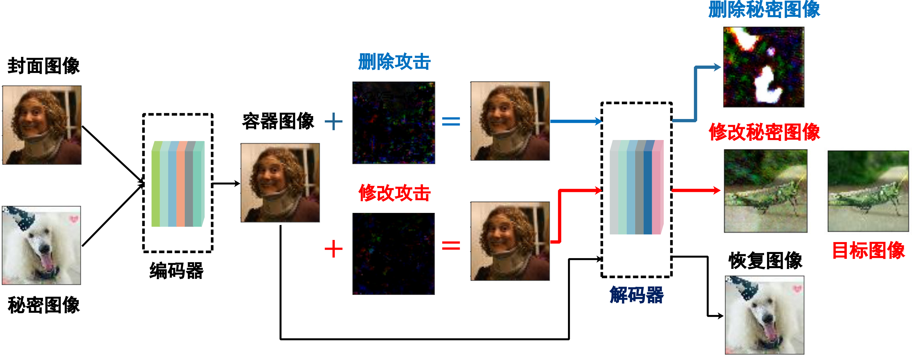

# 基于代理训练和知识蒸馏的深度隐写对抗攻击





## 目录结构
│  attacks.py ：PGD、CW攻击算法
│  dataUtils.py  ：加载数据集
│  deep-steg.py ：深度隐写模型训练算法
│  evaluation.py ：在数据集进行评估删除攻击、修改攻击和秘密图像内容分析攻击
│  modelgpu_tiny_all_60poch.pth 在Tiny-ImageNet数据集上训练好的深度隐写模型
│  utils.py PSNR（峰值信噪比）、APE（平均像素误差）计算
│  
├─fig
│      1.png 对抗攻击示意图
│      
├─log 该目录下输出攻击算法在数据集上的评估结果
│      
├─models 该目录为目标模型和代理模型
│  │  AE.py
│  │  AEmodels.py
│          
├─pytorch_ssim 该目录为结构性相似度评价算法（SSIM）
│          
├─surrogateAttack 该目录输出黑盒环境下修改攻击的效果图（代理有目标攻击）
│      
└─transDecoder 该目录输出采用不同数量的实例时（64，128，256，512，1024，2048，5000），知识蒸馏后得到的学生模型（代理模型解码器）

## 使用方法

### 下载数据集
使用 [Tiny ImageNet]([https://paperswithcode.com/dataset/tiny-imagenet) 和尺寸随机裁剪至64*64的 [COCO](https://cocodataset.org/) `val2017` 子集作为攻击算法评估数据集. 
解压数据集后，在evaluation.py 中修改数据集目录 `dataDir`.

### 安装依赖
```commandline
pip install torch
pip install cv2
pip install matplotlib
pip install tqdm
pip install torchvision
```
### 运行评估算法

```commandline
python evaluation.py
```

## 目标模型
```commandline
Baluja, Shumeet. "Hiding images in plain sight: Deep steganography." Advances in neural information processing systems 30 (2017).
```
